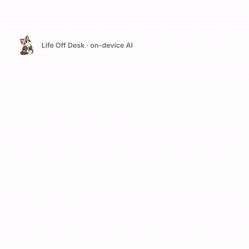
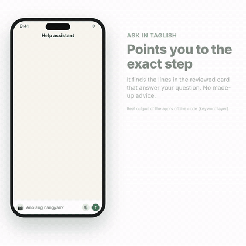
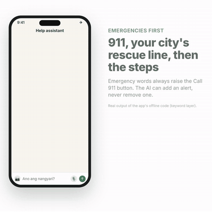
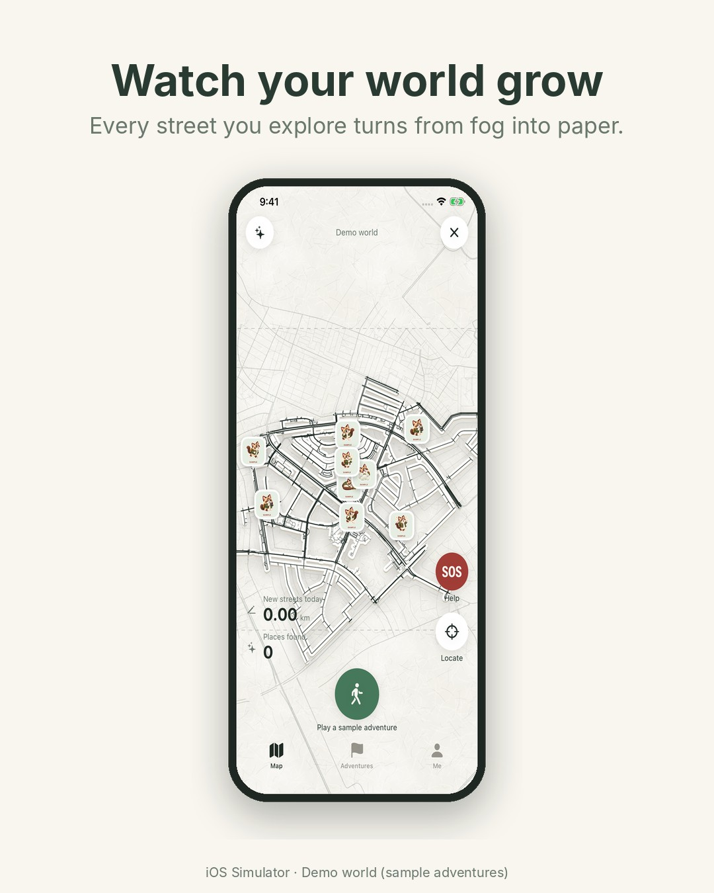
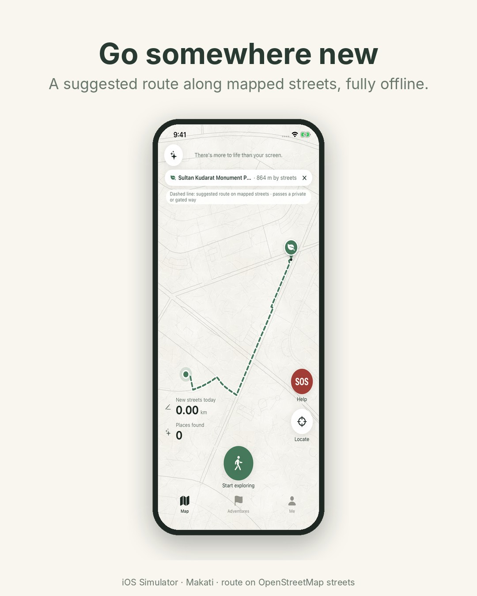
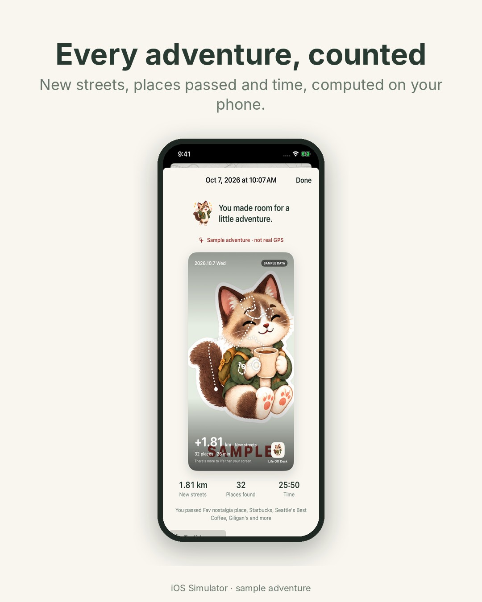
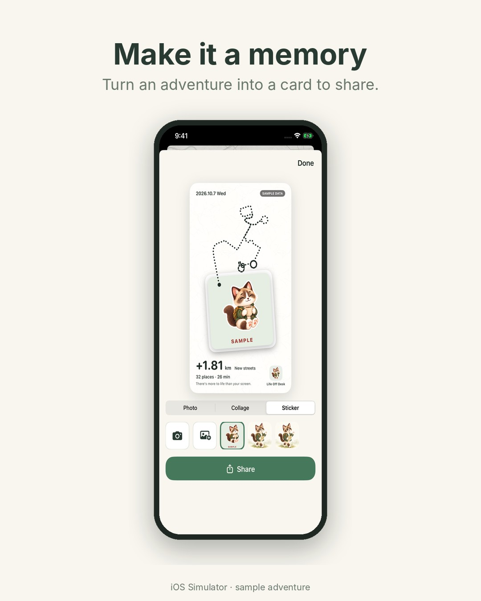

# Life Off Desk

An offline iPhone app that gets desk-bound people outside. An on-device AI notices when your world is getting smaller ("Uyyy, lumiliit na ang mundo mo!") and suggests a real nearby place. You can ask in Taglish ("tahimik na park, 30 mins lang"). As you walk, a paper map lifts its fog over the streets you actually covered. If something goes wrong, the SOS help chat (Taglish, typed, spoken or with a photo) points you to reviewed first-aid and roadside cards, 911, local hotlines and the nearest police or hospital.

Built for the AppBuildersPH Hackathon 2026 (Local AI). **The app works in Airplane Mode.** Qwen3-1.7B runs on the iPhone through llama.cpp, and the app makes no network calls.

- **Submission answers** (what runs locally, what needs internet, disclosures, why local AI): [docs/SUBMISSION.md](docs/SUBMISSION.md)
- **What has been tested, and what hasn't:** [docs/BUILD-STATUS.md](docs/BUILD-STATUS.md)
- **Launch video (59 s):** [square](marketing/life-off-desk-launch-square.mp4) · [16:9](marketing/life-off-desk-launch.mp4)
- **Feature guide** (what each feature does and where to find it): [jump below](#feature-guide)

<p align="center">
  
  
  
</p>
<p align="center">
  
  
  
  
</p>
<p align="center"><sub>Chat GIFs show the real output of the app's offline routing code (keyword layer) in a recreation of the chat screen. Map screens are Simulator captures of the labelled demo world.</sub></p>

---

## Run it on your Mac and iPhone

### What you need

| | Requirement |
|---|---|
| Mac | Apple silicon, recent macOS, **Xcode 16 or later** with the iOS platform installed (CI builds on macOS 15). About 5 GB free disk. |
| iPhone | **iOS 17 or later**, ideally with 6 GB RAM or more (tested on an iPhone 12 Pro Max). Connected with a cable. |
| Apple ID | A free Apple ID is enough for a personal build. Free-account builds expire after 7 days. |
| Tools | [Homebrew](https://brew.sh) for XcodeGen. Python 3 and `curl` are already on macOS. |
| Internet | **Only once, for setup:** about 1.34 GB of downloads (model and runtime). The app itself needs no internet. |

### 1. Get the code and the model

```bash
git clone https://github.com/lewisjohnvillamor/Lifeoffdesk.git
cd Lifeoffdesk
brew install xcodegen
scripts/setup_ios.sh
```

`setup_ios.sh` does four things:
- Downloads the pinned **Qwen3-1.7B Q4_K_M** model (≈1.28 GB, Hugging Face) and the **llama.cpp b11429** iOS framework (≈62 MB, GitHub releases).
- Checks every file's SHA-256 against `config/materials-lock.json`.
- Unpacks the framework into `vendor/`.
- Generates `LifeOffDesk/LifeOffDesk.xcodeproj`.

Running it again is safe, and it skips files that are already verified.

### 2. Sign and run on the iPhone

1. Open the project: `open LifeOffDesk/LifeOffDesk.xcodeproj`
2. In Xcode, select the **LifeOffDesk** target → **Signing & Capabilities**:
   - **Team:** choose your Apple ID. Add it under Xcode → Settings → Accounts if it isn't listed.
   - **Bundle Identifier:** change `com.lifeoffdesk.app` to something unique, e.g. `com.yourname.lifeoffdesk`. Otherwise Xcode reports that the ID is unavailable.
3. Plug in the iPhone, unlock it and tap **Trust This Computer**.
4. Turn on **Developer Mode**: iPhone Settings → Privacy & Security → Developer Mode → On. The phone restarts.
5. In Xcode, pick your iPhone as the run destination and press **Run (⌘R)**. The first build takes a few minutes, because the 1.28 GB model is copied into the app.
6. If the iPhone says **"Untrusted Developer"**: Settings → General → VPN & Device Management → your Apple ID → **Trust**. Then run again.

### 3. Check that the AI is really local

1. Put the iPhone in **Airplane Mode**. GPS still works.
2. In the app, open the gear icon (Settings) → **On-device AI diagnostics**:
   - **Verify SHA-256** confirms the bundled model matches the pinned file.
   - **Load model now** warms it up, so the first request is fast.
   - **Run 60 held-out cases** runs the built-in Taglish planner checks on the phone.
3. Try the features:
   - **Planner:** tap ✨ on the map and type or say *"tahimik na park, 30 mins lang"*.
   - **Demo world:** Settings → **Demo map (sample adventures)** shows a filled-in map of labelled sample adventures.
   - **Help chat:** tap **SOS** → **Ask the help assistant** and ask *"na-flat gulong ko"*, *"may nahimatay, hindi humihinga"* or *"Ano ang number ng NLEX?"*.
   - **Walking:** tap **Start exploring** outdoors. Walk, then hold to end and see your new streets and the recap card.

The app asks for location (needed), plus microphone and speech recognition (for voice input) and camera and photos (for walk photos and the help chat). Everything is processed on the phone.

### Troubleshooting

| Problem | Fix |
|---|---|
| `Install XcodeGen first` | `brew install xcodegen`, then run `scripts/setup_ios.sh` again. |
| Checksum mismatch or interrupted download | Delete the partial file in `downloads/` and run `scripts/setup_ios.sh` again. |
| "Failed to register bundle identifier" / no signing team | Set your Team and a unique Bundle Identifier (step 2.2). |
| Build fails for an iPhone Simulator destination | The pinned llama.cpp framework is iPhone-only. Pick a real iPhone, or use the Simulator build below. |
| "Developer Mode disabled" / "Untrusted Developer" | Steps 2.4 and 2.6. |
| AI says unavailable on the phone | Settings → On-device AI diagnostics shows why: model file missing, checksum mismatch, or not enough memory. Close other apps and load again. |
| Help-chat hotlines missing after pulling new code | Run `scripts/setup_ios.sh` again so the project picks up new data files. |

### No iPhone? Simulator build (UI only)

```bash
xcodegen generate --spec LifeOffDesk/project-simulator.yml
open LifeOffDesk/LifeOffDeskSimulator.xcodeproj
```

Choose an iPhone simulator and Run. Every screen, the maps, routes, help cards, hotlines and demo world work here. The on-device model doesn't run in the Simulator (the runtime has no Simulator slice), so AI features say they are unavailable and the help chat uses its keyword routing. Locations are simulated.

### Run the tests (no iPhone needed)

```bash
swift test --package-path Packages/LifeOffDeskCore   # 165 core tests: GPS filtering, sessions, routing, help-chat routing, hotlines, AI output validation
python3 -m unittest discover -s tests                  # data-preparation scripts
```

CI (GitHub Actions) runs both, plus an unsigned iPhone build, on every push.

---

## Feature guide

The app has three tabs at the bottom: **Map**, **Adventures** and **Me**. Everything below works offline.

### Map tab: explore

| Feature | Where | What it does |
|---|---|---|
| **Start an adventure** | Green **Start exploring** button at the bottom | Records your walk with GPS. Tap **Spot** to take a photo pinned to the map. **Pause** stops recording. **Hold to end** finishes the walk and opens the recap. |
| **Fog-of-war map** | The map itself | Streets you have walked turn from fog into paper. New streets today and places found are counted on the left. Pinch to zoom, drag to pan, **Locate** to recenter. |
| **"Your world" coach** | A card at the top of the map | The on-device AI notices when your world is getting smaller (computed from your walks) and suggests real unexplored streets or a new place. Tap **Tara!** or **Mamaya na**. |
| **Ask for a place (Taglish)** | ✨ button, top left: the "Saan tayo?" sheet | Type or tap 🎙️ and say e.g. *"tahimik na park, 30 mins lang"*. The AI reads the request; real nearby places come back with street distance and honest caveats. Tap **Go** to set one as your destination. |
| **Route and arrival** | After choosing a destination | A dashed line shows a suggested route along mapped streets. Walk there and **"Nakarating ka na!"** appears, with **End adventure** or **Keep exploring**. |
| **Photo pins and found places** | Small pins and dots on the map | Tap a photo pin to see the photo. Tap a place dot to see its name and **Go again**. Nearby pins group into clusters as you zoom out. |

### SOS: help, even with no signal

Tap the red **SOS** button on the right of the map to open **Get help**.

| Feature | Where | What it does |
|---|---|---|
| **Call 911** | Top of Get help | One tap to call. |
| **Your location** | Get help → **Your location** | Coordinates and the nearest named place, to read to a dispatcher. **Copy** it or **Text it** (SMS works without mobile data). |
| **Nearest police, hospitals, fire stations** | Get help, below your location | From the offline map, with distances and a **Route** button. |
| **Help assistant (chat)** | Get help → **Ask the help assistant** | Ask in Taglish or English, by typing, 🎙️ voice or 📷 photo (e.g. a flat tire). The on-device AI and a Taglish keyword safety net pick a reviewed card: first aid, car trouble, heat, floods, stroke, heart attack and more. The steps that answer your question are highlighted, and every card links its source. |
| ↳ **Emergencies** | Typing e.g. *"hindi humihinga"*, *"stroke"* | A red **Call 911 now** button comes first, then your city's rescue line, then the steps. The AI can raise an emergency but can never hide one. |
| ↳ **Hotlines** | Asking e.g. *"Ano ang number ng NLEX?"*, *"number ng highway patrol"* | Tap-to-call numbers from 26 bundled hotlines (911, Red Cross, MMDA, HPG, expressways, Metro Manila LGUs), each with its source and check date. These are looked up, never generated. |
| ↳ **Lost** | *"naligaw ako"* | Tells you where you are, asks where you want to go, finds the place on the offline map and offers **Route**. |
| ↳ **Wrong card?** | Under an answer | "Hindi ito ang tanong mo? Subukan:" offers other cards in one tap. |

### Adventures tab: your history

| Feature | Where | What it does |
|---|---|---|
| **Para sa'yo** | Top card → **Find me a place** | A recommendation based on the places you like, never one you just saw. The AI chooses among real candidates and rule checks verify the pick (distance, not recent). **Let's go: show the route**, **Save**, or **Hindi ito · ibang lugar** for another. |
| **Search your adventures** | Search box (*"short walks last week na may photos"*) | The AI turns your question into filters, shown as chips you can remove. The search runs on your saved walks. |
| **This week** | Summary card | Adventures, new streets and places found compared with last week. |
| **Watch your world grow** | Replay button | Replays your walks on the map; the camera follows the pointer. |
| **Calendar** | Month view | Days you walked are marked; tap a day to see its adventures. |
| **Recap and card** | Open any adventure | Computed stats (walked, new streets, places, time), **Taglish recap** (AI-picked highlights, values computed), **Make a card** (Photo, Collage or Sticker with on-device cut-out) and **Share**. |

### Me tab and Settings

| Feature | Where | What it does |
|---|---|---|
| **Your totals and spots** | Me tab | Total new streets, places and photos you have collected. |
| **Demo world** | Me tab card, or Settings → **Demo map (sample adventures)** | Fills the map with labelled sample adventures, for demos. **Back to my map** returns to yours. |
| **Preferences** | Settings | Favourite kinds of places, usual time, search radius and access needs. The planner and recommendations use them. |
| **On-device AI diagnostics** | Settings → **On-device AI diagnostics** | Model and hash (**Verify SHA-256**), **Load model now**, load and response times, and **Run 60 held-out cases**. |
| **Privacy** | Settings | **Erase my adventures and exploration**. Nothing ever leaves the phone. |

## How it works

- **On-device AI** (Qwen3-1.7B through llama.cpp, inside the app): it understands Taglish requests, filters your adventure history, picks recap highlights, words the "your world" coach, picks among real recommendation candidates, and routes help-chat questions to a reviewed card.
  - Every call is **grammar-constrained JSON plus a validator**.
  - The model chooses; deterministic code supplies the facts, numbers, places and advice text. It cannot invent a place, a distance or first-aid steps.
- **Apple on-device frameworks:** Speech (voice input), and Vision (recognising objects in help-chat photos, cutting out photo stickers).
- **Deterministic engines:** place search and walking routes over bundled OpenStreetMap streets, GPS filtering and street matching, the fog-of-war map, arrival detection, recaps, a Taglish emergency keyword safety net, and the hotline lookup.
- **Data on the phone:** Metro Manila map packs (detailed Makati, Muntinlupa, Taguig, Pasay, Parañaque), 28 sourced help cards, 26 sourced hotlines, plus your walks, photos and preferences. No account, no server.

## Repository layout

- `LifeOffDesk/`: the SwiftUI iPhone app. `project.yml` is the XcodeGen spec; the `.xcodeproj` is generated, not committed.
- `Packages/LifeOffDeskCore/`: platform-independent logic and its tests.
- `scripts/`: model and runtime downloads, `setup_ios.sh`, map-data preparation, and help-card, keyword and hotline builders.
- `Tools/PlannerEval/`: runs the planner against the pinned model on a dev machine.
- `marketing/`: website, mockups and the Remotion launch-video project.
- `docs/`: [Mac setup details](docs/MAC-SETUP.md), [build status](docs/BUILD-STATUS.md), [help guide and AI safety](docs/SAFETY-GUIDE.md), [submission](docs/SUBMISSION.md), [architecture](docs/ARCHITECTURE-AND-DATA.md), [brand guide](docs/BRAND-GUIDE.md).
- `THIRD-PARTY-NOTICES.md`: models, libraries, data sources and tools.

## Honest status

- **Tested on the founder's iPhone 12 Pro Max:** the core flows (offline AI, outdoor walk, camera and stickers, help chat), reported working.
- **Not phone-tested yet:** the newest changes (hotlines; stroke, heart-attack and seizure cards; arrival detection) compile in CI.
- **Demo data:** sample adventures are synthetic and labelled "SAMPLE".
- **Deferred:** full Luzon map packs, turn-by-turn navigation, accounts and reviewed accessibility facts.

**Phone measurements** (iPhone 12 Pro Max, `iPhone13,4`, iOS 26.6.2, Qwen3-1.7B Q4_K_M, `eval/taglish-heldout.json`, 60 cases, 2026-10-10). The Airplane Mode run had no network path at the start or the end:

| | Airplane Mode run | Earlier run the same day |
|---|---|---|
| Schema-valid / intent | 60/60, 47/60 | 60/60, 47/60 |
| Case latency | p50 7.38 s, p95 8.84 s (n=60) | p50 6.09 s, p95 7.50 s (n=60) |
| Generated tokens/s | 7.42 | not recorded |
| Highest sampled memory | 532 MB physical footprint | not recorded |
| Thermal state | serious, then critical | not recorded |
| Battery | 65% charging at start and end (USB cable; not a drain test) | not recorded |
| 60-case time | 412.8 s (warm-up 14.54 s) | 340.0 s (warm-up 13.59 s) |

Reports: [Airplane Mode](eval/results/taglish-heldout-iphone12promax-airplane-2026-10-10.json), [earlier run](eval/results/taglish-heldout-iphone12promax-2026-10-10.json). The Linux CPU development-machine score for this set is 46/60 intent and is not a phone result. Map-frame pacing was not measured. See [build status](docs/BUILD-STATUS.md).

Map data © OpenStreetMap contributors (ODbL). Help cards link their public sources; hotlines list their sources and check dates. They are offline copies, so re-check before relying on them, and call **911** in an emergency.
